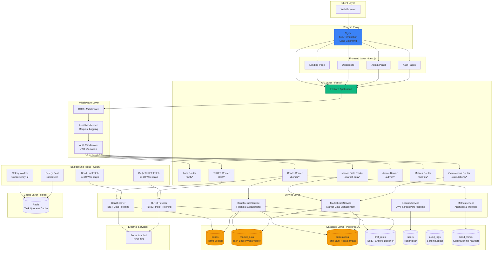
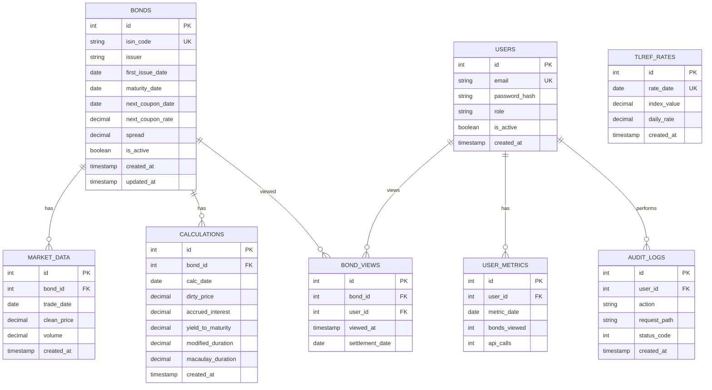
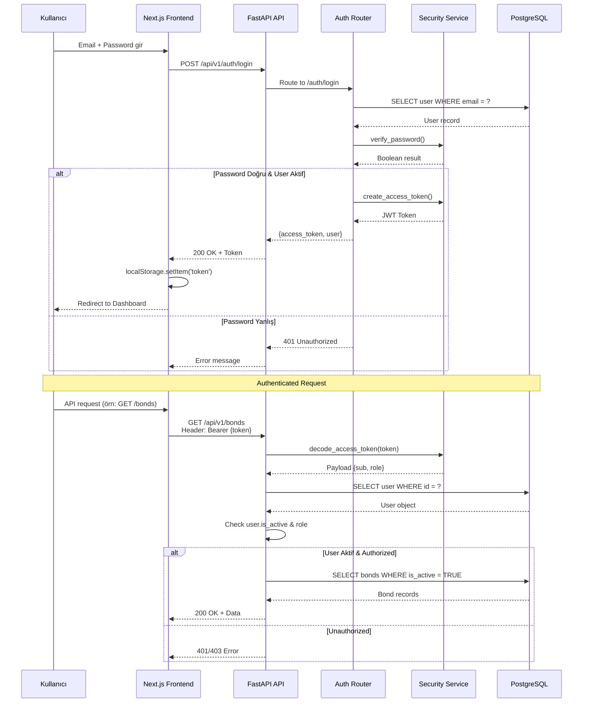
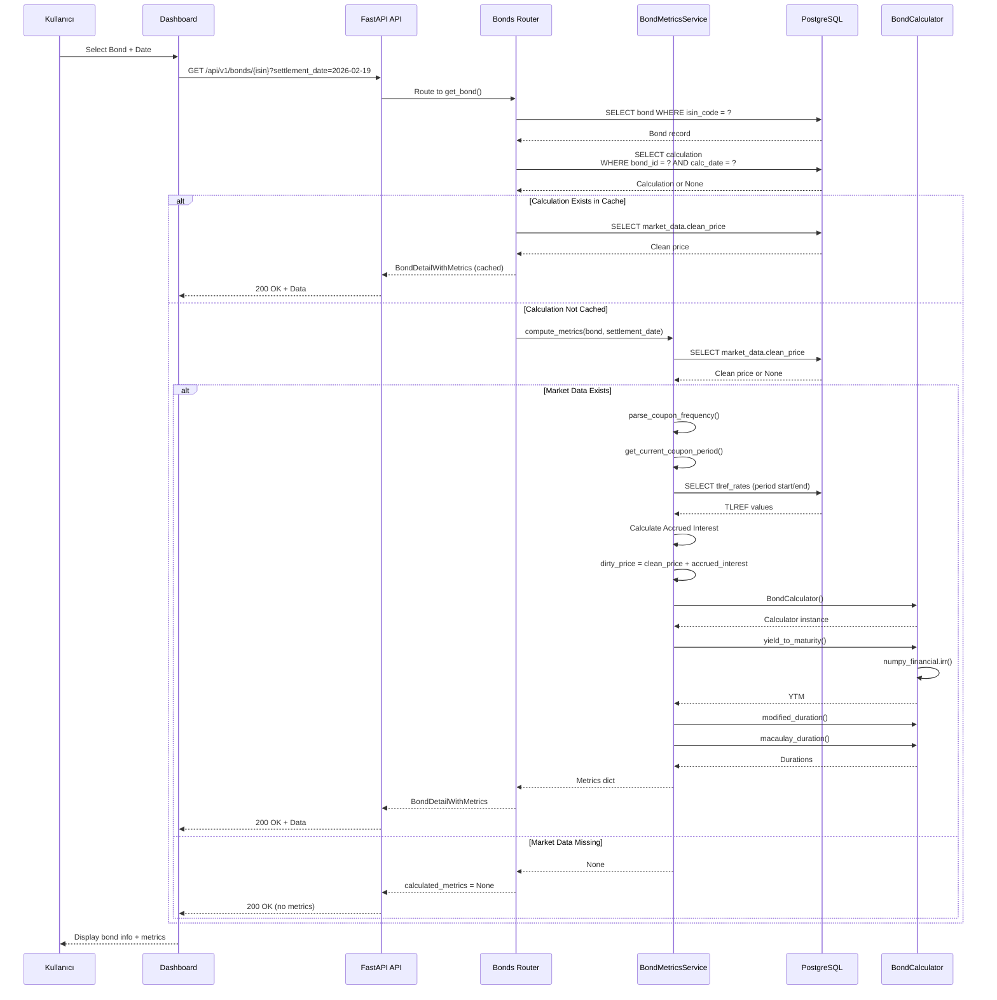
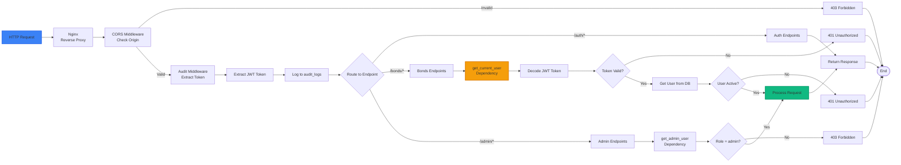

# FinCalc - Turk Devlet Tahvil Analiz Platformu

Turk Devlet Tahvilleri (TRT/TRB) icin degerleme, fiyat takibi ve analiz sistemi.

## Teknoloji Yigini

- **Frontend:** Next.js 14 (App Router), TypeScript, Tailwind CSS, Shadcn/UI, Recharts
- **Backend:** Python FastAPI, SQLAlchemy (async), numpy-financial
- **Veritabani:** PostgreSQL (tum parasal degerler DECIMAL)
- **Kuyruk:** Celery + Redis
- **Altyapi:** Docker Compose, Turborepo

## Hizli Baslangic

### Docker ile (Onerilen)

```bash
# Tum servisleri baslat
docker-compose up -d

# DB schema'yi olustur (otomatik init.sql ile)
# API: http://localhost:8000/api/docs
# Web: http://localhost:3000
```

### Manuel Gelistirme

```bash
# 1. PostgreSQL ve Redis baslat
docker-compose up -d postgres redis

# 2. Python backend
cd apps/api
pip install -r requirements.txt
uvicorn app.main:app --reload --port 8000

# 3. Celery worker
celery -A app.tasks.celery_app worker --loglevel=info

# 4. Celery beat (zamanlanmis gorevler)
celery -A app.tasks.celery_app beat --loglevel=info

# 5. Next.js frontend
cd apps/web
npm install
npm run dev
```

## Erisim ve Yonlendirme (Path tabanli, tek origin)

Web uygulamasi **tek origin** (ana domain) uzerinden path ile calisir; oturum (localStorage) tum sayfalarda gecerli olur.

| URL | Aciklama |
|---|---|
| `https://domain.com/` | Urun tanitim (landing) |
| `https://domain.com/dashboard` | Tahvil verileri, grafikler |
| `https://domain.com/admin` | Veri / kullanici yonetimi |
| `https://domain.com/login`, `/signup` | Kimlik dogrulama |
| `https://api.domain.com` veya `https://domain.com/api/v1` | Backend API |

**Subdomain yonlendirme:** `dashboard.domain.com` ve `admin.domain.com` adresleri 301 ile ana domain path'ine yonlendirilir (ornegin `dashboard.domain.com` -> `domain.com/dashboard`). Boylece eski linkler ve yer imleri calisir, oturum tek origin'de korunur.

Lokal gelistirme icin `/etc/hosts` (istege bagli):
```
127.0.0.1 landing.localhost dashboard.localhost admin.localhost
```

## API Endpointleri

- `POST /api/v1/auth/login` - Giris
- `GET /api/v1/bonds/` - Tahvil listesi
- `GET /api/v1/bonds/{isin}` - Tahvil detay
- `GET /api/v1/market-data/{isin}` - Piyasa verileri
- `POST /api/v1/calculations/run` - Hesaplama calistir
- `POST /api/v1/import/csv` - CSV dosyasi yukle
- `GET /api/v1/tlref/latest` - Son TLREF orani
- `POST /api/v1/tlref/fetch-daily` - BIST'ten TLREF cek

## Production: SSL Sertifikasi (Debian)

Tum domain'ler icin tek sertifika alip Nginx container'inin kullandigi volume'a yazmak icin:

```bash
# Proje dizininde
cd /path/to/FinCalc

# .env icinde DOMAIN ve (istege bagli) CERTBOT_EMAIL olmali
export DEBIAN_FRONTEND=noninteractive
chmod +x scripts/obtain-ssl.sh
./scripts/obtain-ssl.sh
```

Sertifikalar `certbot_certs` volume'una yazilir; `docker-compose.prod.yml` ile Nginx zaten bu volume'u `/etc/letsencrypt` olarak mount eder, ekstra kopyalama gerekmez.

**Tek seferde (script olmadan) calistirmak istersen:**

```bash
cd /path/to/FinCalc
export DEBIAN_FRONTEND=noninteractive
source .env
docker volume create certbot_webroot
docker volume create certbot_certs
mkdir -p nginx/temp
cat > nginx/temp/default.conf << EOF
server {
    listen 80;
    server_name ${DOMAIN} www.${DOMAIN} dashboard.${DOMAIN} admin.${DOMAIN} api.${DOMAIN};
    location /.well-known/acme-challenge/ { root /var/www/certbot; }
    location / { return 200 "OK"; add_header Content-Type text/plain; }
}
EOF
docker rm -f nginx-ssl-temp 2>/dev/null
docker run -d --name nginx-ssl-temp -p 80:80 -v "$(pwd)/nginx/temp:/etc/nginx/conf.d:ro" -v certbot_webroot:/var/www/certbot:rw nginx:alpine
sleep 3
docker run --rm -v certbot_webroot:/var/www/certbot:rw -v certbot_certs:/etc/letsencrypt:rw certbot/certbot certonly --webroot --webroot-path=/var/www/certbot --email "${CERTBOT_EMAIL:-admin@$DOMAIN}" --agree-tos --no-eff-email --non-interactive -d "$DOMAIN" -d "www.$DOMAIN" -d "dashboard.$DOMAIN" -d "admin.$DOMAIN" -d "api.$DOMAIN"
docker rm -f nginx-ssl-temp
rm -rf nginx/temp
docker-compose -f docker-compose.prod.yml up -d nginx
```

**HTTPS "connection refused" (ERR_CONNECTION_REFUSED) ise:** Sertifika yokken Nginx sadece 80 acar, 443 acilmaz. Cozum: sertifika al, sonra Nginx'i zorla yeniden baslat:

```bash
./scripts/obtain-ssl.sh
docker-compose -f docker-compose.prod.yml up -d --force-recreate nginx
```

Kontrol: `chmod +x scripts/check-https.sh && ./scripts/check-https.sh` — sertifika, 443 ve firewall kontrolu yapar. Sunucuda 80/443 portlari acik olmali (ufw veya cloud guvenlik kurallari).

**"cert not readable" / HTTP only:** Sertifikalar `obtain-ssl.sh` ile `certbot_certs` volume'una yazilir. Compose proje adiyla farkli bir volume (ornegin `FinCalc_certbot_certs`) kullanirsa nginx bos volume'a bakar. `docker-compose.prod.yml` icinde volume isimleri sabitlendi (`name: certbot_certs`). Nginx'i yeniden olustur: `docker-compose -f docker-compose.prod.yml up -d --force-recreate nginx`.

**Nginx hâlâ 443 acmiyorsa (config/sertifika):**

```bash
# Nginx loglarinda hangi config kullanildigini gor (SSL mi HTTP-only mi)
docker logs fincalc-nginx 2>&1

# Volume icinde sertifika var mi, domain adi ne?
docker run --rm -v certbot_certs:/etc/letsencrypt:ro alpine ls -la /etc/letsencrypt/live/

# Container icinde DOMAIN ve sertifika kontrolu
docker exec fincalc-nginx sh -c 'echo "DOMAIN=$DOMAIN"; ls -la /etc/letsencrypt/live/$DOMAIN/ 2>/dev/null || ls /etc/nginx/conf.d/'
```

Nginx image'i guncellendi (entrypoint: sertifika klasorunden DOMAIN otomatik tespit, config testi). Tekrar build edip ac: `docker-compose -f docker-compose.prod.yml build nginx --no-cache && docker-compose -f docker-compose.prod.yml up -d --force-recreate nginx`

## Varsayilan Giris (sadece gelistirme)

- Email: `admin@fincalc.com`
- Sifre: `admin123` (production'da `ADMIN_INIT_PASSWORD` ile ilk admin olusturulur; ilk giriste sifreyi degistirin).

**Production icin:** [docs/PRODUCTION_CHECKLIST.md](docs/PRODUCTION_CHECKLIST.md) dosyasindaki maddeleri uygulayin (ENVIRONMENT, secret'lar, sifre degisimi).

## Proje Yapisi

```
FinCalc/
├── apps/
│   ├── web/          # Next.js 14 Frontend
│   └── api/          # Python FastAPI Backend
├── packages/
│   └── shared/       # Paylasimli TypeScript tipleri
├── database/
│   └── init.sql      # PostgreSQL schema
└── docker-compose.yml
```

## Sistem Mimarisi

### Genel Mimari



### Veritabanı Şeması



### Authentication & Authorization Flow



### Bond Detail & Calculation Flow



### Bond Data Fetching Flow (BIST'ten)

```mermaid
flowchart TD
    Start([Celery Beat<br/>19:00 Weekdays]) --> Trigger[Trigger fetch_bond_list Task]
    Trigger --> CeleryWorker[Celery Worker]
    CeleryWorker --> Download[Download tbliste.zip<br/>from BIST]
    Download --> Extract[Extract XLS from ZIP]
    Extract --> Parse[Parse XLS File<br/>xlrd.open_workbook]
    Parse --> ProcessRow[Process Each Row]
    ProcessRow --> ExtractISIN[Extract ISIN Code]
    ExtractISIN --> ValidateISIN{ISIN Valid?}
    ValidateISIN -->|No| NextRow[Skip Row]
    ValidateISIN -->|Yes| ExtractFields[Extract All Fields<br/>Dates, Prices, Rates]
    ExtractFields --> ParseDates[Parse Dates & Decimals]
    ParseDates --> CreateRecord[Create Bond Record]
    CreateRecord --> AddToBatch[Add to Batch]
    AddToBatch --> CheckBatch{Batch Size<br/>= 200?}
    CheckBatch -->|No| NextRow
    CheckBatch -->|Yes| UpsertBatch[UPSERT Batch to DB<br/>ON CONFLICT UPDATE]
    UpsertBatch --> NextRow
    NextRow --> MoreRows{More Rows?}
    MoreRows -->|Yes| ProcessRow
    MoreRows -->|No| GetCurrentISINs[Get Current Active ISINs]
    GetCurrentISINs --> Compare[Compare DB vs File ISINs]
    Compare --> FindMissing[Find Missing ISINs]
    FindMissing --> Deactivate[UPDATE bonds<br/>SET is_active = FALSE]
    Deactivate --> Commit[Commit Transaction]
    Commit --> End([Task Complete])
    
    style Start fill:#10b981,stroke:#059669,stroke-width:2px
    style Download fill:#3b82f6,stroke:#2563eb,stroke-width:2px
    style UpsertBatch fill:#f59e0b,stroke:#d97706,stroke-width:2px
    style End fill:#10b981,stroke:#059669,stroke-width:2px
```



### API Request Flow (Middleware Chain)



## Detaylı Dokümantasyon

Tüm sistem akış şemaları, algoritmalar ve detaylı diagramlar için: [docs/SYSTEM-ARCHITECTURE.md](docs/SYSTEM-ARCHITECTURE.md)
