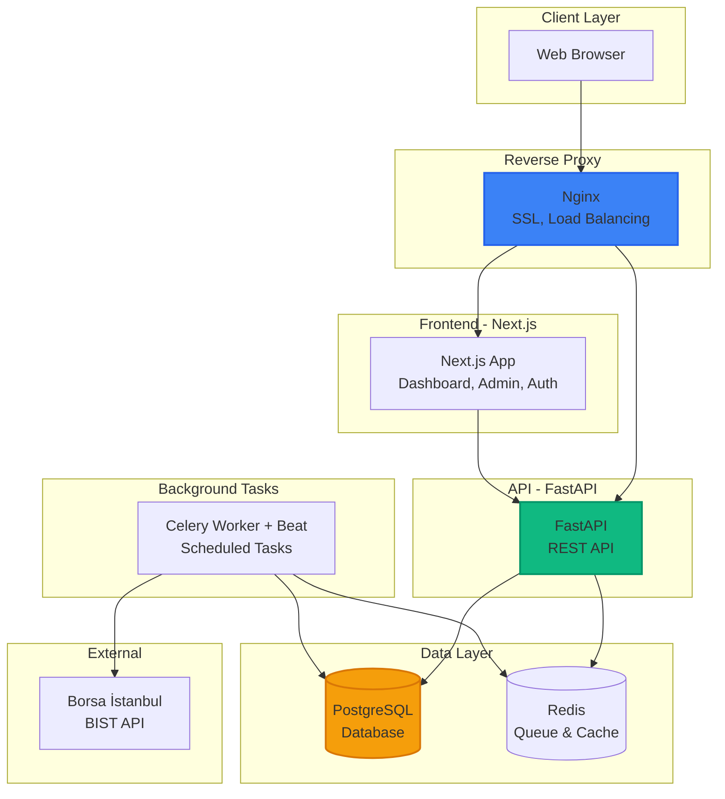

# Bondley - Türk Devlet Tahvil Analiz Platformu

Türk Devlet Tahvilleri (TRT/TRB) için değerleme, fiyat takibi ve analiz sistemi.

## Teknoloji Yığını

- **Frontend:** Next.js 14 (App Router), TypeScript, Tailwind CSS, Shadcn/UI, Recharts
- **Backend:** Python FastAPI, SQLAlchemy (async), numpy-financial
- **Veritabanı:** PostgreSQL (tüm parasal değerler DECIMAL)
- **Kuyruk:** Celery + Redis
- **Altyapı:** Docker Compose, Turborepo, Nginx

## Hızlı Başlangıç

### Docker ile (Önerilen)

```bash
# Tüm servisleri başlat
docker-compose up -d

# Servisler:
# - API: http://localhost:8000/api/docs
# - Web: http://localhost:3000
# - PostgreSQL: localhost:5432
# - Redis: localhost:6379
```

### Manuel Geliştirme

```bash
# 1. PostgreSQL ve Redis başlat
docker-compose up -d postgres redis

# 2. Python backend
cd apps/api
pip install -r requirements.txt
uvicorn app.main:app --reload --port 8000

# 3. Celery worker (ayrı terminal)
celery -A app.tasks.celery_app worker --loglevel=info

# 4. Celery beat (ayrı terminal)
celery -A app.tasks.celery_app beat --loglevel=info

# 5. Next.js frontend (ayrı terminal)
cd apps/web
npm install
npm run dev
```

## Proje Yapısı

```
FinCalc/
├── apps/
│   ├── web/          # Next.js 14 Frontend
│   └── api/          # Python FastAPI Backend
├── packages/
│   └── shared/       # Paylaşımlı TypeScript tipleri
├── database/
│   └── init.sql      # PostgreSQL schema
├── nginx/            # Nginx configuration
├── scripts/           # Deployment ve utility scriptleri
├── docs/              # Detaylı dokümantasyon
├── docker-compose.yml              # Development
└── docker-compose.prod.yml         # Production
```

## Sistem Mimarisi



## Önemli Endpoint'ler

- `POST /api/v1/auth/login` - Giriş
- `GET /api/v1/bonds/` - Tahvil listesi
- `GET /api/v1/bonds/{isin}` - Tahvil detay ve hesaplamalar
- `GET /api/v1/tlref/latest` - Son TLREF oranı
- `GET /api/v1/market-data/{isin}` - Piyasa verileri

Tüm API dokümantasyonu: `http://localhost:8000/api/docs`

## Geliştirme

### Ortam Değişkenleri

`.env.example` dosyasını `.env` olarak kopyalayın ve değerleri doldurun:

```bash
cp .env.example .env
```

### Veritabanı Migrasyonları

Schema otomatik olarak `database/init.sql` ile oluşturulur. Manuel migration için:

```bash
docker exec -i fincalc-postgres psql -U fincalc -d fincalc < database/init.sql
```

### Test ve Lint

```bash
# Frontend
cd apps/web
npm run lint
npm run build

# Backend
cd apps/api
ruff check .
```

## Production Deployment

Production deployment için detaylı rehber: [docs/PRODUCTION_CHECKLIST.md](docs/PRODUCTION_CHECKLIST.md)

### CI/CD ve Canary Deployment

Otomatik CI/CD pipeline ve canary deployment sistemi kurulumu: [docs/CI_CD_SETUP.md](docs/CI_CD_SETUP.md)

### SSL Sertifikası

SSL sertifikası kurulumu: [scripts/obtain-ssl.sh](scripts/obtain-ssl.sh)

```bash
chmod +x scripts/obtain-ssl.sh
./scripts/obtain-ssl.sh
```

## Sorun Giderme

### Celery Sorunları

Celery beat ve worker sorunlarını teşhis etmek için:

```bash
chmod +x scripts/diagnose-celery.sh
./scripts/diagnose-celery.sh
```

Detaylı rehber: [docs/CELERY_TROUBLESHOOTING.md](docs/CELERY_TROUBLESHOOTING.md)

### Container Durumu

```bash
# Tüm container'ların durumunu kontrol et
docker-compose ps

# Logları görüntüle
docker-compose logs -f [service-name]
```

## Dokümantasyon

- [Sistem Mimarisi](docs/SYSTEM-ARCHITECTURE.md) - Detaylı mimari ve akış şemaları
- [Production Checklist](docs/PRODUCTION_CHECKLIST.md) - Production hazırlık kontrol listesi
- [CI/CD Setup](docs/CI_CD_SETUP.md) - CI/CD ve canary deployment kurulumu
- [Celery Troubleshooting](docs/CELERY_TROUBLESHOOTING.md) - Celery sorun giderme rehberi
- [Security Scorecard](docs/SECURITY_SCORECARD.md) - Güvenlik değerlendirmesi

## Varsayılan Giriş (Sadece Geliştirme)

- **Email:** `admin@fincalc.com`
- **Şifre:** `admin123`

**Önemli:** Production'da `.env.production` dosyasındaki `ADMIN_INIT_PASSWORD` ile ilk admin oluşturulur. İlk girişte şifreyi mutlaka değiştirin.

## Lisans

Bu proje özel bir projedir.

