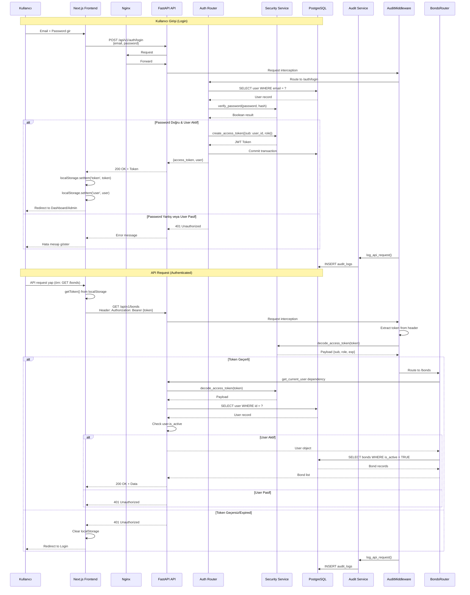
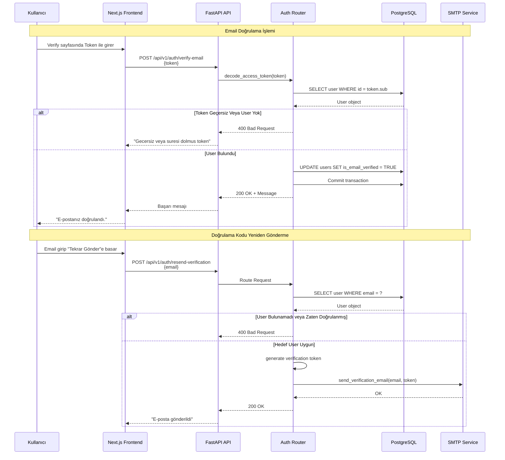
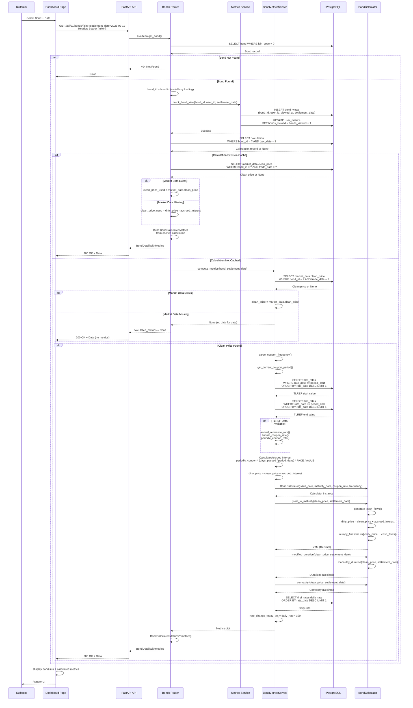
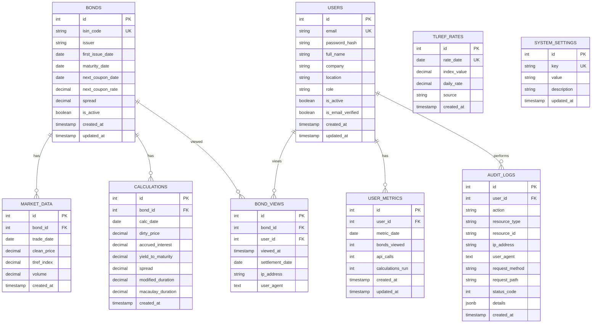
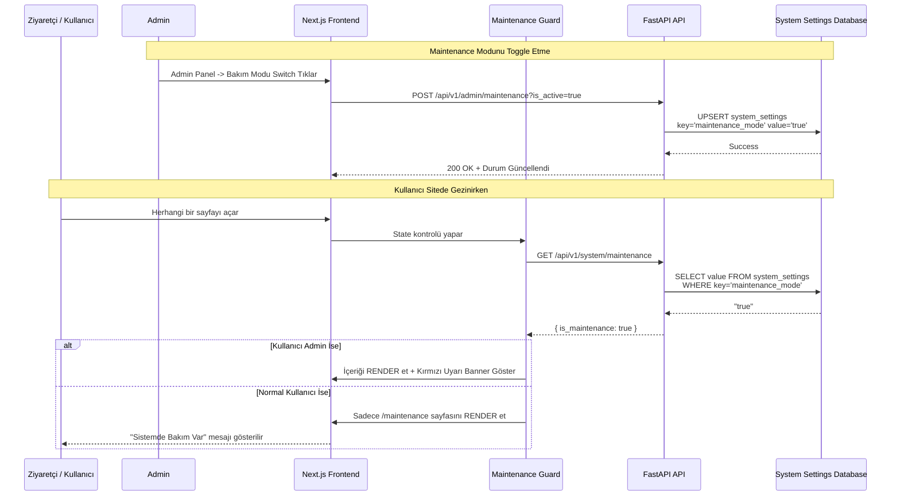
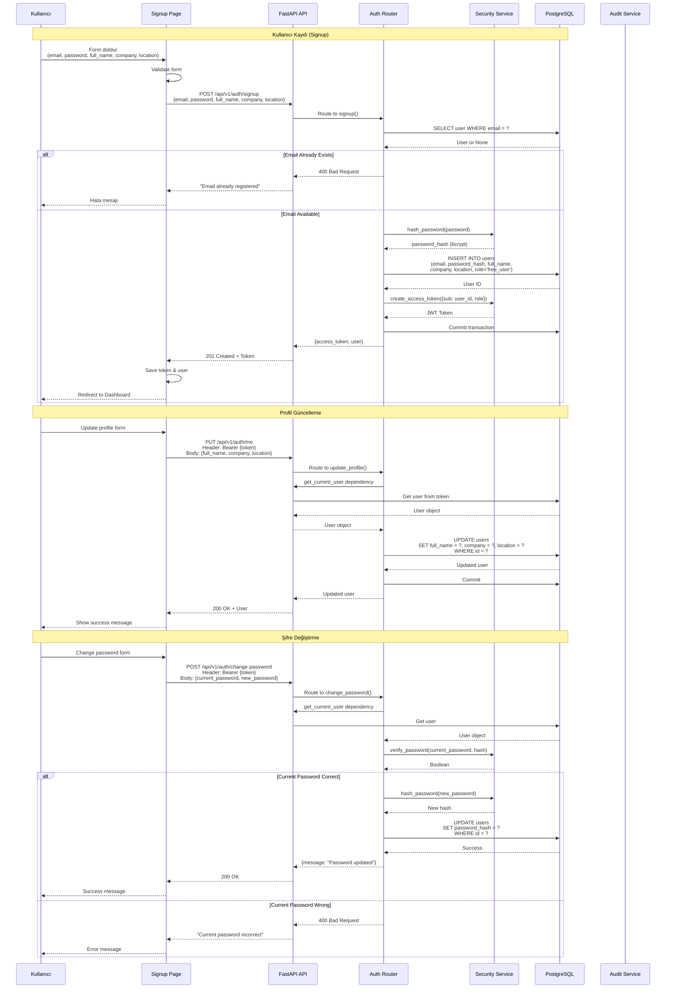
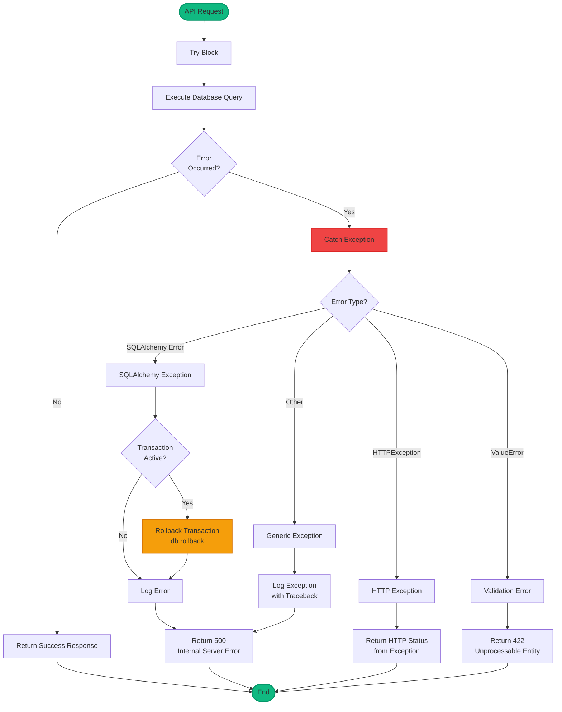
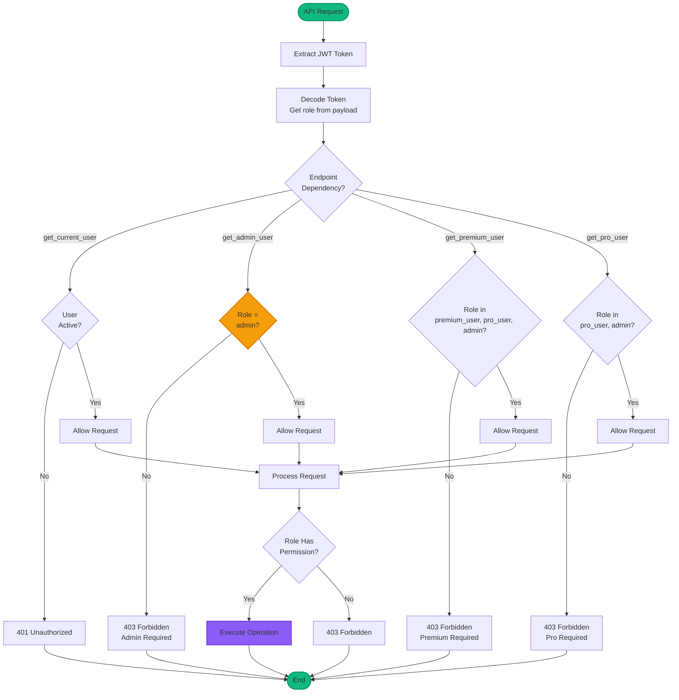

# FinCalc Sistem Mimarisi ve Algoritma Akış Şemaları

Bu dokümantasyon sistemin tüm bileşenlerini, akışlarını ve algoritmalarını detaylı mermaid diagramları ile açıklar.

---

## 1. Sistem Mimarisi (Component Diagram)

```mermaid
graph TB
    subgraph "Client Layer"
        Browser[Web Browser]
        Mobile[Mobile App]
    end
    
    subgraph "Frontend Layer - Next.js"
        Landing[Landing Page]
        Dashboard[Dashboard]
        Admin[Admin Panel]
        Auth[Auth Pages]
    end
    
    subgraph "Reverse Proxy"
        Nginx[Nginx<br/>SSL Termination<br/>Load Balancing]
    end
    
    subgraph "API Layer - FastAPI"
        API[FastAPI Application]
        AuthRouter[Auth Router<br/>/auth/*]
        BondsRouter[Bonds Router<br/>/bonds/*]
        MarketRouter[Market Data Router<br/>/market-data/*]
        CalcRouter[Calculations Router<br/>/calculations/*]
        AdminRouter[Admin Router<br/>/admin/*]
        MetricsRouter[Metrics Router<br/>/metrics/*]
        TLREFRouter[TLREF Router<br/>/tlref/*]
        ImportRouter[CSV Import Router<br/>/import/*]
    end
    
    subgraph "Middleware Layer"
        CORSMiddleware[CORS Middleware]
        AuditMiddleware[Audit Middleware<br/>Request Logging]
        AuthMiddleware[Auth Middleware<br/>JWT Validation]
    end
    
    subgraph "Service Layer"
        BondFetcher[BondFetcher<br/>BIST Data Fetching]
        TLREFFetcher[TLREFFetcher<br/>TLREF Index Fetching]
        BondMetricsService[BondMetricsService<br/>Financial Calculations]
        MarketDataService[MarketDataService<br/>Market Data Management]
        MetricsService[MetricsService<br/>Analytics & Tracking]
        AuditService[AuditService<br/>Audit Logging]
        SecurityService[SecurityService<br/>JWT & Password Hashing]
    end
    
    subgraph "Background Tasks - Celery"
        CeleryWorker[Celery Worker<br/>Concurrency: 2]
        CeleryBeat[Celery Beat<br/>Scheduler]
        DailyTLREFTask[Daily TLREF Fetch<br/>18:30 Weekdays]
        BondListTask[Bond List Fetch<br/>19:00 Weekdays]
        HistoricalTLREFTask[Historical TLREF Fetch]
    end
    
    subgraph "Database Layer - PostgreSQL"
        BondsTable[(bonds<br/>Tahvil Bilgileri)]
        MarketDataTable[(market_data<br/>Tarih Bazlı Piyasa Verileri)]
        CalculationsTable[(calculations<br/>Tarih Bazlı Hesaplamalar)]
        TLREFRatesTable[(tlref_rates<br/>TLREF Endeks Değerleri)]
        UsersTable[(users<br/>Kullanıcılar)]
        AuditLogsTable[(audit_logs<br/>Sistem Logları)]
        BondViewsTable[(bond_views<br/>Görüntülenme Kayıtları)]
        UserMetricsTable[(user_metrics<br/>Kullanıcı Metrikleri)]
        SystemSettingsTable[(system_settings<br/>Sistem Ayarları)]
    end
    
    subgraph "Cache Layer - Redis"
        Redis[(Redis<br/>Task Queue & Cache)]
    end
    
    subgraph "External Services"
        BIST[Borsa Istanbul<br/>BIST API]
    end
    
    Browser --> Nginx
    Mobile --> Nginx
    Nginx --> Landing
    Nginx --> Dashboard
    Nginx --> Admin
    Nginx --> Auth
    Nginx --> API
    
    Landing --> API
    Dashboard --> API
    Admin --> API
    Auth --> API
    
    API --> CORSMiddleware
    CORSMiddleware --> AuditMiddleware
    AuditMiddleware --> AuthMiddleware
    
    AuthMiddleware --> AuthRouter
    AuthMiddleware --> BondsRouter
    AuthMiddleware --> MarketRouter
    AuthMiddleware --> CalcRouter
    AuthMiddleware --> AdminRouter
    AuthMiddleware --> MetricsRouter
    AuthMiddleware --> TLREFRouter
    AuthMiddleware --> ImportRouter
    
    AuthRouter --> SecurityService
    BondsRouter --> BondFetcher
    BondsRouter --> BondMetricsService
    BondsRouter --> MetricsService
    MarketRouter --> MarketDataService
    CalcRouter --> MarketDataService
    AdminRouter --> AuditService
    MetricsRouter --> MetricsService
    TLREFRouter --> TLREFFetcher
    
    BondFetcher --> BIST
    TLREFFetcher --> BIST
    BondMetricsService --> CalculationsTable
    MarketDataService --> MarketDataTable
    MarketDataService --> CalculationsTable
    MetricsService --> BondViewsTable
    MetricsService --> UserMetricsTable
    AuditService --> AuditLogsTable
    SecurityService --> UsersTable
    
    CeleryWorker --> Redis
    CeleryBeat --> Redis
    DailyTLREFTask --> TLREFFetcher
    BondListTask --> BondFetcher
    HistoricalTLREFTask --> TLREFFetcher
    
    BondFetcher --> BondsTable
    TLREFFetcher --> TLREFRatesTable
    MarketDataService --> BondsTable
    BondMetricsService --> BondsTable
    BondMetricsService --> TLREFRatesTable
    BondMetricsService --> MarketDataTable
    
    style API fill:#10b981,stroke:#059669,stroke-width:3px
    style Nginx fill:#3b82f6,stroke:#2563eb,stroke-width:2px
    style BondsTable fill:#f59e0b,stroke:#d97706,stroke-width:2px
    style MarketDataTable fill:#f59e0b,stroke:#d97706,stroke-width:2px
    style CalculationsTable fill:#f59e0b,stroke:#d97706,stroke-width:2px
```



---

## 2. Authentication & Authorization Flow



---

## 2.1. Email Verification & Resend Flow



---

## 3. Bond Data Fetching Flow (BIST'ten Veri Çekme)

```mermaid
flowchart TD
    Start([Celery Beat Scheduler<br/>19:00 Weekdays]) --> Trigger[Trigger fetch_bond_list Task]
    Trigger --> CeleryWorker[Celery Worker Receives Task]
    CeleryWorker --> CreateSession[Create Async DB Session]
    CreateSession --> InitFetcher[Initialize BondFetcher]
    
    InitFetcher --> Download[Download tbliste.zip<br/>from BIST URL]
    Download --> CheckDownload{Download<br/>Success?}
    
    CheckDownload -->|No| Retry{Retry Count<br/>< 3?}
    Retry -->|Yes| Wait[Wait 5 minutes]
    Wait --> Download
    Retry -->|No| LogError[Log Error & Fail Task]
    
    CheckDownload -->|Yes| Extract[Extract XLS from ZIP]
    Extract --> Parse[Parse XLS File<br/>xlrd.open_workbook]
    
    Parse --> ReadRows[Read Rows 1 to N]
    ReadRows --> ProcessRow[Process Each Row]
    
    ProcessRow --> ExtractISIN[Extract ISIN Code<br/>Column 1]
    ExtractISIN --> ValidateISIN{ISIN Valid?<br/>length >= 5}
    
    ValidateISIN -->|No| NextRow[Skip Row]
    ValidateISIN -->|Yes| ExtractFields[Extract All Fields<br/>Issuer, Dates, Prices, etc.]
    
    ExtractFields --> ParseDates[Parse Dates<br/>xlrd.xldate_as_tuple]
    ParseDates --> ParseDecimals[Parse Decimal Values<br/>Prices, Yields, Rates]
    ParseDecimals --> ValidateDates{Days to Maturity<br/>> 0?}
    
    ValidateDates -->|No| NextRow
    ValidateDates -->|Yes| CreateRecord[Create Bond Record Dict]
    
    CreateRecord --> Truncate[Truncate Strings<br/>to DB Max Lengths]
    Truncate --> AddToBatch[Add to Batch Array]
    
    AddToBatch --> CheckBatch{Batch Size<br/>= 200?}
    CheckBatch -->|No| NextRow
    CheckBatch -->|Yes| UpsertBatch[Upsert Batch to DB<br/>ON CONFLICT UPDATE]
    
    UpsertBatch --> NextRow
    NextRow --> MoreRows{More Rows?}
    MoreRows -->|Yes| ProcessRow
    MoreRows -->|No| FinalBatch{Remaining<br/>Records?}
    
    FinalBatch -->|Yes| UpsertBatch
    FinalBatch -->|No| GetCurrentISINs[Get Current Active ISINs<br/>from DB]
    
    GetCurrentISINs --> Compare[Compare DB ISINs vs<br/>File ISINs]
    Compare --> FindMissing[Find Missing ISINs<br/>DB - File]
    
    FindMissing --> Deactivate[UPDATE bonds<br/>SET is_active = FALSE<br/>WHERE isin_code IN missing]
    Deactivate --> Commit[Commit Transaction]
    
    Commit --> ReturnResult[Return Result<br/>{status, upserted, deactivated}]
    ReturnResult --> End([Task Complete])
    
    LogError --> End
    
    style Start fill:#10b981,stroke:#059669,stroke-width:2px
    style Download fill:#3b82f6,stroke:#2563eb,stroke-width:2px
    style Parse fill:#8b5cf6,stroke:#7c3aed,stroke-width:2px
    style UpsertBatch fill:#f59e0b,stroke:#d97706,stroke-width:2px
    style End fill:#10b981,stroke:#059669,stroke-width:2px
```

---

## 4. Bond Detail & Calculation Flow



---

## 5. Daily Calculation Flow (Market Data Service)

```mermaid
flowchart TD
    Start([Admin Triggers<br/>POST /calculations/run-all]) --> GetDate[Get calc_date<br/>or use today]
    GetDate --> GetBonds[SELECT bonds<br/>WHERE is_active = TRUE<br/>AND maturity_date > calc_date]
    
    GetBonds --> LoopStart[For Each Bond]
    LoopStart --> GetMarketData[SELECT market_data<br/>WHERE bond_id = ?<br/>AND trade_date = calc_date]
    
    GetMarketData --> CheckMarketData{Market Data<br/>Exists?}
    
    CheckMarketData -->|No| SkipBond[Skip Bond<br/>Log Warning]
    CheckMarketData -->|Yes| GetTLREF[Get TLREF Rate<br/>for calc_date]
    
    GetTLREF --> ValidateBond{Bond Has Required<br/>Fields?<br/>issue_date, maturity_date}
    
    ValidateBond -->|No| SkipBond
    ValidateBond -->|Yes| CreateCalculator[Create BondCalculator<br/>with bond parameters]
    
    CreateCalculator --> RunAnalysis[Run full_analysis<br/>clean_price, calc_date, tlref_rate]
    
    RunAnalysis --> CalcAccrued[Calculate Accrued Interest<br/>coupon_payment * days_passed / days_in_period]
    CalcAccrued --> CalcDirty[Calculate Dirty Price<br/>clean_price + accrued_interest]
    CalcDirty --> CalcYTM[Calculate YTM<br/>numpy_financial.irr]
    CalcYTM --> CalcDuration[Calculate Durations<br/>Macaulay & Modified]
    CalcDuration --> CalcSpread[Calculate Spread<br/>YTM - TLREF Yield]
    
    CalcSpread --> UpsertCalc[UPSERT calculations<br/>ON CONFLICT UPDATE<br/>bond_id, calc_date]
    
    UpsertCalc --> CommitCalc[Commit Transaction]
    CommitCalc --> NextBond{More Bonds?}
    
    NextBond -->|Yes| LoopStart
    NextBond -->|No| ReturnResult[Return Result<br/>{completed: count}]
    
    SkipBond --> NextBond
    ReturnResult --> End([Complete])
    
    style Start fill:#10b981,stroke:#059669,stroke-width:2px
    style RunAnalysis fill:#8b5cf6,stroke:#7c3aed,stroke-width:2px
    style UpsertCalc fill:#f59e0b,stroke:#d97706,stroke-width:2px
    style End fill:#10b981,stroke:#059669,stroke-width:2px
```

---

## 6. Database Schema & Relationships



---

## 6.1. Maintenance Mode Flow (Bakım Modu)



---

## 7. API Request Flow (Middleware Chain)

```mermaid
flowchart LR
    Request[HTTP Request] --> Nginx[Nginx<br/>Reverse Proxy]
    Nginx --> CORS[CORS Middleware<br/>Check Origin]
    
    CORS -->|Invalid Origin| Reject1[403 Forbidden]
    CORS -->|Valid Origin| Audit[Audit Middleware<br/>Extract Token]
    
    Audit --> ExtractToken[Extract JWT Token<br/>from Authorization Header]
    ExtractToken --> LogRequest[Log Request to<br/>audit_logs table]
    
    LogRequest --> Route{Route to<br/>Endpoint}
    
    Route -->|/auth/*| AuthEndpoint[Auth Endpoints<br/>No Auth Required]
    Route -->|/bonds/*| BondsEndpoint[Bonds Endpoints<br/>Auth Required]
    Route -->|/admin/*| AdminEndpoint[Admin Endpoints<br/>Admin Required]
    Route -->|/metrics/*| MetricsEndpoint[Metrics Endpoints<br/>Auth Required]
    
    AuthEndpoint --> ProcessAuth[Process Request]
    BondsEndpoint --> AuthCheck[get_current_user<br/>Dependency]
    AdminEndpoint --> AdminCheck[get_admin_user<br/>Dependency]
    MetricsEndpoint --> AuthCheck
    
    AuthCheck --> DecodeToken[Decode JWT Token]
    DecodeToken --> ValidateToken{Token Valid?}
    
    ValidateToken -->|No| Reject2[401 Unauthorized]
    ValidateToken -->|Yes| GetUser[Get User from DB]
    GetUser --> CheckActive{User Active?}
    
    CheckActive -->|No| Reject3[401 Unauthorized]
    CheckActive -->|Yes| ProcessRequest[Process Request]
    
    AdminCheck --> CheckRole{Role = admin?}
    CheckRole -->|No| Reject4[403 Forbidden]
    CheckRole -->|Yes| ProcessRequest
    
    ProcessAuth --> Response1[Response]
    ProcessRequest --> Response2[Response]
    
    Response1 --> AuditLog[Log Response to<br/>audit_logs]
    Response2 --> AuditLog
    
    AuditLog --> Return[Return Response]
    
    Reject1 --> Return
    Reject2 --> Return
    Reject3 --> Return
    Reject4 --> Return
    
    style Request fill:#3b82f6,stroke:#2563eb,stroke-width:2px
    style AuthCheck fill:#f59e0b,stroke:#d97706,stroke-width:2px
    style ProcessRequest fill:#10b981,stroke:#059669,stroke-width:2px
    style Return fill:#10b981,stroke:#059669,stroke-width:2px
```



---

## 8. Bond Calculator Algorithm Flow

```mermaid
flowchart TD
    Start([BondCalculator.yield_to_maturity]) --> ValidateSettlement[Validate settlement_date<br/><= maturity_date]
    ValidateSettlement --> ValidatePrice[Validate clean_price<br/>> 0]
    
    ValidatePrice --> CalcDirtyPrice[Calculate Dirty Price<br/>clean_price + accrued_interest]
    
    CalcDirtyPrice --> GenerateCF[Generate Cash Flows<br/>from settlement_date to maturity]
    
    GenerateCF --> GetCouponDates[Get All Coupon Dates<br/>from issue_date to maturity_date]
    GetCouponDates --> FilterFuture[Filter Dates > settlement_date]
    
    FilterFuture --> BuildCFArray[Build Cash Flow Array<br/>For each coupon date:<br/>- Coupon payment<br/>- Last: Coupon + Face Value]
    
    BuildCFArray --> CheckEmpty{CF Array<br/>Empty?}
    CheckEmpty -->|Yes| ReturnZero[Return 0]
    CheckEmpty -->|No| BuildIRRArray[Build IRR Array<br/>[-dirty_price, CF1, CF2, ..., CFN]]
    
    BuildIRRArray --> CallIRR[numpy_financial.irr<br/>IRR Array]
    CallIRR --> CheckIRR{IRR Valid?<br/>Not NaN?}
    
    CheckIRR -->|No| ReturnZero
    CheckIRR -->|Yes| Annualize[Annualize Yield<br/>periodic_irr * coupon_frequency]
    
    Annualize --> Quantize[Quantize Result<br/>6 decimal places]
    Quantize --> ReturnYTM[Return YTM]
    
    ReturnZero --> End([End])
    ReturnYTM --> End
    
    style Start fill:#10b981,stroke:#059669,stroke-width:2px
    style GenerateCF fill:#8b5cf6,stroke:#7c3aed,stroke-width:2px
    style CallIRR fill:#f59e0b,stroke:#d97706,stroke-width:2px
    style End fill:#10b981,stroke:#059669,stroke-width:2px
```

---

## 9. TLREF Data Fetching Flow

```mermaid
flowchart TD
    Start([Celery Beat<br/>18:30 Daily]) --> Trigger[Trigger fetch_daily_tlref]
    Trigger --> Worker[Celery Worker]
    Worker --> CreateSession[Create Async DB Session]
    CreateSession --> InitFetcher[Initialize TLREFFetcher]
    
    InitFetcher --> Download[Download CSV<br/>from BIST URL<br/>bisttlrefendeksi.csv]
    
    Download --> CheckDownload{Download<br/>Success?}
    CheckDownload -->|No| Retry{Retry < 3?}
    Retry -->|Yes| Wait[Wait 5 min]
    Wait --> Download
    Retry -->|No| LogError[Log Error]
    
    CheckDownload -->|Yes| ParseCSV[Parse CSV File<br/>Skip header rows]
    ParseCSV --> ReadRows[Read Data Rows]
    
    ReadRows --> ProcessRow[Process Each Row]
    ProcessRow --> ExtractDate[Extract Date<br/>Column 0]
    ExtractDate --> ExtractIndex[Extract Index Value<br/>Column 1]
    ExtractIndex --> ExtractDailyRate[Extract Daily Rate<br/>Column 2]
    
    ExtractDailyRate --> ParseDate[Parse Date String<br/>DD.MM.YYYY format]
    ParseDate --> ParseDecimal[Parse Decimal Values<br/>index_value, daily_rate]
    
    ParseDecimal --> CheckExists{Record Exists<br/>for date?}
    CheckExists -->|Yes| UpdateRecord[UPDATE tlref_rates<br/>SET index_value = ?,<br/>daily_rate = ?<br/>WHERE rate_date = ?]
    CheckExists -->|No| InsertRecord[INSERT INTO tlref_rates<br/>rate_date, index_value, daily_rate]
    
    UpdateRecord --> Commit[Commit Transaction]
    InsertRecord --> Commit
    
    Commit --> NextRow{More Rows?}
    NextRow -->|Yes| ProcessRow
    NextRow -->|No| ReturnResult[Return Result<br/>{status, records_processed}]
    
    ReturnResult --> End([Complete])
    LogError --> End
    
    style Start fill:#10b981,stroke:#059669,stroke-width:2px
    style Download fill:#3b82f6,stroke:#2563eb,stroke-width:2px
    style ParseCSV fill:#8b5cf6,stroke:#7c3aed,stroke-width:2px
    style Commit fill:#f59e0b,stroke:#d97706,stroke-width:2px
    style End fill:#10b981,stroke:#059669,stroke-width:2px
```

---

## 10. User Registration & Profile Management Flow



---

## 11. Admin Operations Flow

```mermaid
flowchart TD
    Start([Admin Login]) --> CheckRole{Role = admin?}
    CheckRole -->|No| Reject[403 Forbidden]
    CheckRole -->|Yes| AdminPanel[Admin Panel Access]
    
    AdminPanel --> UserMgmt[User Management]
    AdminPanel --> BondSync[Bond Sync]
    AdminPanel --> Stats[Statistics]
    AdminPanel --> Logs[Audit Logs]
    
    UserMgmt --> ListUsers[GET /admin/users<br/>List All Users]
    UserMgmt --> CreateUser[POST /admin/users<br/>Create User]
    UserMgmt --> UpdateUser[PUT /admin/users/{id}<br/>Update User]
    UserMgmt --> DeleteUser[DELETE /admin/users/{id}<br/>Deactivate User]
    
    ListUsers --> QueryDB[SELECT users<br/>ORDER BY created_at DESC]
    QueryDB --> ReturnUsers[Return User List]
    
    CreateUser --> ValidateEmail{Email<br/>Unique?}
    ValidateEmail -->|No| Error1[400 Bad Request]
    ValidateEmail -->|Yes| HashPassword[Hash Password]
    HashPassword --> InsertUser[INSERT INTO users]
    InsertUser --> ReturnUser[Return Created User]
    
    UpdateUser --> GetUser[Get User by ID]
    GetUser --> CheckExists{User<br/>Exists?}
    CheckExists -->|No| Error2[404 Not Found]
    CheckExists -->|Yes| UpdateFields[UPDATE users<br/>SET fields = ?]
    UpdateFields --> ReturnUpdated[Return Updated User]
    
    DeleteUser --> Deactivate[UPDATE users<br/>SET is_active = FALSE]
    Deactivate --> ReturnSuccess[Return Success]
    
    BondSync --> TriggerSync[POST /bonds/sync<br/>Trigger Bond Fetch]
    TriggerSync --> BondFetcher[BondFetcher.fetch_and_sync]
    BondFetcher --> DownloadBIST[Download from BIST]
    DownloadBIST --> ParseXLS[Parse XLS]
    ParseXLS --> UpsertBonds[Upsert Bonds]
    UpsertBonds --> DeactivateMissing[Deactivate Missing Bonds]
    DeactivateMissing --> ReturnSync[Return Sync Result]
    
    Stats --> GetStats[GET /admin/stats]
    GetStats --> QueryStats[Query Multiple Tables<br/>COUNT users, bonds, etc.]
    QueryStats --> Aggregate[Aggregate Statistics]
    Aggregate --> ReturnStats[Return Stats]
    
    Logs --> GetLogs[GET /admin/logs<br/>With filters]
    GetLogs --> QueryLogs[SELECT audit_logs<br/>WHERE filters<br/>ORDER BY created_at DESC]
    QueryLogs --> Paginate[Paginate Results]
    Paginate --> ReturnLogs[Return Log List]
    
    ReturnUsers --> End([End])
    ReturnUser --> End
    ReturnUpdated --> End
    ReturnSuccess --> End
    ReturnSync --> End
    ReturnStats --> End
    ReturnLogs --> End
    Error1 --> End
    Error2 --> End
    Reject --> End
    
    style Start fill:#10b981,stroke:#059669,stroke-width:2px
    style AdminPanel fill:#8b5cf6,stroke:#7c3aed,stroke-width:2px
    style BondSync fill:#3b82f6,stroke:#2563eb,stroke-width:2px
    style End fill:#10b981,stroke:#059669,stroke-width:2px
```

---

## 12. Metrics Tracking Flow

```mermaid
flowchart TD
    Start([API Request]) --> AuditMiddleware[Audit Middleware]
    AuditMiddleware --> ExtractUser[Extract User ID<br/>from JWT Token]
    ExtractUser --> LogRequest[Log to audit_logs<br/>INSERT audit_logs]
    
    LogRequest --> CheckEndpoint{Endpoint Type?}
    
    CheckEndpoint -->|/bonds/{isin}| TrackBondView[Track Bond View]
    CheckEndpoint -->|Any API Call| TrackAPICall[Track API Call]
    CheckEndpoint -->|/calculations/run| TrackCalculation[Track Calculation]
    
    TrackBondView --> GetBondID[Get bond_id from request]
    GetBondID --> CheckUnique{Unique View<br/>Today?}
    
    CheckUnique -->|No| Skip[Skip Duplicate]
    CheckUnique -->|Yes| InsertView[INSERT bond_views<br/>bond_id, user_id, viewed_at,<br/>settlement_date, ip, user_agent]
    
    InsertView --> UpdateUserMetrics[UPDATE user_metrics<br/>SET bonds_viewed = bonds_viewed + 1<br/>WHERE user_id = ? AND metric_date = TODAY]
    
    UpdateUserMetrics --> CheckMetricExists{Metric Record<br/>Exists?}
    CheckMetricExists -->|No| InsertMetric[INSERT user_metrics<br/>user_id, metric_date, bonds_viewed = 1]
    CheckMetricExists -->|Yes| Done1[Complete]
    
    TrackAPICall --> UpdateAPICall[UPDATE user_metrics<br/>SET api_calls = api_calls + 1]
    UpdateAPICall --> CheckMetricExists
    
    TrackCalculation --> UpdateCalc[UPDATE user_metrics<br/>SET calculations_run = calculations_run + 1]
    UpdateCalc --> CheckMetricExists
    
    InsertMetric --> Done1
    Done1 --> Commit[Commit Transaction]
    Skip --> End([End])
    Commit --> End
    
    style Start fill:#10b981,stroke:#059669,stroke-width:2px
    style TrackBondView fill:#8b5cf6,stroke:#7c3aed,stroke-width:2px
    style InsertView fill:#f59e0b,stroke:#d97706,stroke-width:2px
    style End fill:#10b981,stroke:#059669,stroke-width:2px
```

---

## 13. Application Startup Flow

```mermaid
flowchart TD
    Start([Application Start]) --> LoadConfig[Load Settings<br/>from .env]
    LoadConfig --> ValidateConfig{Production<br/>Config Valid?}
    
    ValidateConfig -->|No| RaiseError[Raise ValueError]
    ValidateConfig -->|Yes| CreateEngine[Create Async DB Engine<br/>pool_size=20, max_overflow=10]
    
    CreateEngine --> TestConnection[Test DB Connection<br/>SELECT version()]
    TestConnection --> CheckConnection{Connection<br/>Success?}
    
    CheckConnection -->|No| LogError[Log Error & Raise]
    CheckConnection -->|Yes| AcquireLock[Acquire Advisory Lock<br/>pg_advisory_lock(999999)]
    
    AcquireLock --> RunMigrations[Run Migrations]
    RunMigrations --> CreateTables[Base.metadata.create_all<br/>Create Missing Tables]
    
    CreateTables --> MigrateTLREF[Migrate TLREF Table<br/>rate_value -> index_value]
    MigrateTLREF --> MigrateBonds[Migrate Bonds Table<br/>Add New Columns]
    MigrateBonds --> MigrateUsers[Migrate Users Table<br/>Add New Columns]
    MigrateUsers --> MigrateNewTables[Migrate New Tables<br/>audit_logs, bond_views, etc.]
    
    MigrateNewTables --> ReleaseLock[Release Advisory Lock<br/>pg_advisory_unlock(999999)]
    ReleaseLock --> EnsureAdmin[Ensure Admin User<br/>Check if admin exists]
    
    EnsureAdmin --> CheckAdmin{Admin<br/>Exists?}
    CheckAdmin -->|No| CreateAdmin[Create Admin User<br/>email: admin@fincalc.com<br/>password: from .env]
    CheckAdmin -->|Yes| SkipAdmin[Skip Admin Creation]
    
    CreateAdmin --> AddMiddleware[Add Middleware<br/>CORS, Audit]
    SkipAdmin --> AddMiddleware
    
    AddMiddleware --> RegisterRouters[Register API Routers<br/>/auth, /bonds, /admin, etc.]
    RegisterRouters --> SetupLifespan[Setup Lifespan Events]
    
    SetupLifespan --> StartupComplete[Startup Complete<br/>Application Ready]
    StartupComplete --> Listen[Start Uvicorn Server<br/>Listen on Port 8000]
    
    Listen --> Ready([Application Ready<br/>Accepting Requests])
    
    RaiseError --> End([Exit])
    LogError --> End
    
    style Start fill:#10b981,stroke:#059669,stroke-width:2px
    style RunMigrations fill:#8b5cf6,stroke:#7c3aed,stroke-width:2px
    style EnsureAdmin fill:#f59e0b,stroke:#d97706,stroke-width:2px
    style Ready fill:#10b981,stroke:#059669,stroke-width:2px
```

---

## 14. Frontend Page Rendering Flow

```mermaid
flowchart TD
    Start([User Navigates]) --> CheckAuth{User<br/>Authenticated?}
    
    CheckAuth -->|No| CheckPublic{Public<br/>Route?}
    CheckPublic -->|Yes| RenderPublic[Render Public Page<br/>Landing, Login, Signup]
    CheckPublic -->|No| RedirectLogin[Redirect to /login]
    
    CheckAuth -->|Yes| GetToken[Get Token from<br/>localStorage]
    GetToken --> ValidateToken{Token<br/>Valid?}
    
    ValidateToken -->|No| ClearAuth[Clear localStorage<br/>Redirect to Login]
    ValidateToken -->|Yes| CheckRoute{Route Type?}
    
    CheckRoute -->|/dashboard| DashboardPage[Dashboard Page]
    CheckRoute -->|/admin| CheckAdminRole{Role =<br/>admin?}
    CheckRoute -->|/landing| LandingPage[Landing Page]
    
    CheckAdminRole -->|No| RedirectDashboard[Redirect to Dashboard]
    CheckAdminRole -->|Yes| AdminPage[Admin Panel]
    
    DashboardPage --> LoadBonds[Load Bonds List<br/>GET /api/v1/bonds]
    LoadBonds --> DisplayBonds[Display Bonds Table]
    
    DisplayBonds --> UserAction{User Action?}
    UserAction -->|Select Bond| LoadBondDetail[Load Bond Detail<br/>GET /api/v1/bonds/{isin}]
    UserAction -->|Change Date| UpdateDate[Update Selected Date]
    UserAction -->|Search| FilterBonds[Filter Bonds List]
    
    LoadBondDetail --> GetMetrics[Get Calculated Metrics<br/>with settlement_date]
    GetMetrics --> DisplayMetrics[Display Metrics<br/>Dirty Price, YTM, Duration, etc.]
    
    UpdateDate --> ReloadMetrics[Reload Metrics<br/>with New Date]
    ReloadMetrics --> DisplayMetrics
    
    AdminPage --> LoadUsers[Load Users List<br/>GET /admin/users]
    AdminPage --> LoadStats[Load Statistics<br/>GET /admin/stats]
    AdminPage --> LoadLogs[Load Audit Logs<br/>GET /admin/logs]
    
    LandingPage --> LoadSummary[Load Public Summary<br/>GET /api/v1/public/summary]
    LoadSummary --> DisplaySummary[Display Summary Stats]
    
    DisplayBonds --> End([End])
    DisplayMetrics --> End
    RenderPublic --> End
    RedirectLogin --> End
    RedirectDashboard --> End
    FilterBonds --> End
    LoadUsers --> End
    LoadStats --> End
    LoadLogs --> End
    DisplaySummary --> End
    
    style Start fill:#10b981,stroke:#059669,stroke-width:2px
    style CheckAuth fill:#f59e0b,stroke:#d97706,stroke-width:2px
    style LoadBondDetail fill:#8b5cf6,stroke:#7c3aed,stroke-width:2px
    style End fill:#10b981,stroke:#059669,stroke-width:2px
```

---

## 15. Complete System Data Flow

```mermaid
flowchart TB
    subgraph "External Data Sources"
        BIST[Borsa Istanbul<br/>BIST API]
    end
    
    subgraph "Data Ingestion Layer"
        CeleryBeat[Celery Beat<br/>Scheduler]
        DailyTLREF[Daily TLREF Task<br/>18:30 Weekdays]
        DailyBonds[Daily Bonds Task<br/>19:00 Weekdays]
    end
    
    subgraph "Data Processing"
        TLREFFetcher[TLREFFetcher<br/>Parse CSV]
        BondFetcher[BondFetcher<br/>Parse XLS]
    end
    
    subgraph "Database Layer"
        TLREFRates[(tlref_rates)]
        Bonds[(bonds)]
        MarketData[(market_data)]
        Calculations[(calculations)]
    end
    
    subgraph "API Layer"
        BondsAPI[/bonds endpoints]
        MarketAPI[/market-data endpoints]
        CalcAPI[/calculations endpoints]
    end
    
    subgraph "Business Logic"
        BondMetricsService[BondMetricsService<br/>Financial Calculations]
        MarketDataService[MarketDataService<br/>Market Data Management]
    end
    
    subgraph "Frontend"
        Dashboard[Dashboard UI]
        Admin[Admin Panel]
    end
    
    BIST -->|CSV Download| TLREFFetcher
    BIST -->|ZIP Download| BondFetcher
    
    CeleryBeat -->|Schedule| DailyTLREF
    CeleryBeat -->|Schedule| DailyBonds
    
    DailyTLREF --> TLREFFetcher
    DailyBonds --> BondFetcher
    
    TLREFFetcher -->|INSERT/UPDATE| TLREFRates
    BondFetcher -->|UPSERT| Bonds
    
    Dashboard -->|GET /bonds/{isin}| BondsAPI
    Admin -->|POST /bonds/sync| BondsAPI
    
    BondsAPI -->|Query| Bonds
    BondsAPI -->|Query| MarketData
    BondsAPI -->|Query| Calculations
    BondsAPI -->|Compute| BondMetricsService
    
    BondMetricsService -->|Query| TLREFRates
    BondMetricsService -->|Query| MarketData
    BondMetricsService -->|Calculate| Calculations
    
    MarketAPI -->|Query/Insert| MarketData
    CalcAPI -->|Trigger| MarketDataService
    
    MarketDataService -->|Query| Bonds
    MarketDataService -->|Query| MarketData
    MarketDataService -->|Compute| BondMetricsService
    MarketDataService -->|Upsert| Calculations
    
    Calculations -->|Read| Dashboard
    MarketData -->|Read| Dashboard
    
    style BIST fill:#3b82f6,stroke:#2563eb,stroke-width:2px
    style CeleryBeat fill:#10b981,stroke:#059669,stroke-width:2px
    style BondMetricsService fill:#8b5cf6,stroke:#7c3aed,stroke-width:2px
    style Calculations fill:#f59e0b,stroke:#d97706,stroke-width:2px
```

---

## 16. Error Handling & Rollback Flow



---

## 17. Role-Based Access Control (RBAC) Flow



---

## 18. Caching Strategy Flow

```mermaid
flowchart TD
    Start([API Request]) --> CheckCache{Cache<br/>Available?}
    
    CheckCache -->|Redis Available| CheckRedis{Key Exists<br/>in Redis?}
    CheckCache -->|No Redis| QueryDB[Query Database]
    
    CheckRedis -->|Yes| GetCache[Get from Cache]
    CheckRedis -->|No| QueryDB
    
    GetCache --> ValidateCache{Cache<br/>Valid?}
    ValidateCache -->|Yes| ReturnCache[Return Cached Data]
    ValidateCache -->|No| QueryDB
    
    QueryDB --> ProcessData[Process Data]
    ProcessData --> StoreCache{Store in<br/>Cache?}
    
    StoreCache -->|Yes| SetRedis[Set Redis Key<br/>TTL: 5-15 minutes]
    StoreCache -->|No| ReturnData[Return Data]
    
    SetRedis --> ReturnData
    ReturnCache --> End([End])
    ReturnData --> End
    
    Note1[Cache Keys:<br/>- bonds:list<br/>- bond:{isin}:{date}<br/>- stats:summary<br/>- tlref:latest]
    
    style Start fill:#10b981,stroke:#059669,stroke-width:2px
    style CheckRedis fill:#3b82f6,stroke:#2563eb,stroke-width:2px
    style QueryDB fill:#f59e0b,stroke:#d97706,stroke-width:2px
    style End fill:#10b981,stroke:#059669,stroke-width:2px
```

---

Bu dokümantasyon sistemin tüm bileşenlerini, akışlarını ve algoritmalarını kapsar. Her diagram belirli bir sistem bileşenini veya iş akışını detaylı olarak gösterir.
