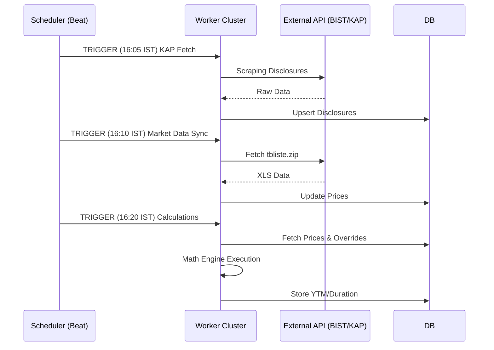

# Bondley: Advanced Technical Overview (v2.0)

This document provides a comprehensive deep-dive into the Bondley architecture, serving as the technical source of truth for engineering audits and institutional stakeholders.

## 1. Executive Summary
Bondley is a financial engineering platform that provides high-fidelity analytics for the Turkish Fixed-Income market. It distinguishes itself by integrating real-time KAP (Public Disclosure Platform) data with official BIST (Borsa Istanbul) listings, resolving data conflicts mathematically to provide the most accurate yield and duration metrics available in the market.

## 2. Directory Architecture (Turborepo)
The project utilizes a monorepo structure powered by **Turborepo** for unified dependency management and rapid CI/CD pipelines.

```text
.
├── apps
│   ├── api              # FastAPI Backend (Python 3.11+)
│   │   ├── app
│   │   │   ├── api      # v1 REST Routes
│   │   │   ├── core     # Security, Config, Database initialization
│   │   │   ├── models   # SQLAlchemy 2.0 (Async) models
│   │   │   ├── schemas  # Pydantic v2 validation models
│   │   │   ├── services # Domain Logic & Bond Mathematics
│   │   │   └── tasks    # Celery Workers & Periodic Schedules
│   │   └── migrations   # Alembic Database Migration scripts
│   └── web              # Next.js Frontend (React 18+)
│       ├── src
│       │   ├── app      # App Router (Pages & Layouts)
│       │   ├── components # Shadcn/UI Component Library
│       │   └── lib      # API Client & State Management
├── docs                 # Professional & Technical Documentation
└── docker               # Production configuration files
```

## 3. Financial Domain Logic & Services
The core intelligence of Bondley is encapsulated in granular services that follow the Single Responsibility Principle.

### Bond Calculation Motor (`app/services/bond_calculator.py`)
- **Engine**: Pure Python implementation using the `Decimal` library to ensure 0-tolerance for floating-point errors.
- **Algorithms**:
    - **Yield to Maturity (YTM)**: Employs the Newton-Raphson approximation for IRR calculation.
    - **Duration/Convexity**: Implements Macualay and Modified Duration formulas with second-order convexity analysis.
    - **Day Count**: Standardizes on `Act/Act` (ISMA-compliant) for government and corporate yields.

### Data Resolution Engine (`app/services/kap_data_resolver.py`)
- **Arbitration**: A proprietary logic layer that compares BIST `tbliste` metadata with active KAP disclosures.
- **Overriding**: Automatically triggers a "resolved state" if KAP data (e.g., a new coupon rate for a floating bond) is timestamped after the last BIST official update.

## 4. Data Persistence Layer
Bondley uses **PostgreSQL 15+** with optimized indexing strategy for time-series financial data.

| Table | Purpose | Volume / Density |
| :--- | :--- | :--- |
| `users` | User accounts and authentication data. | ~500+ records. |
| `user_settings` | User preferences and configuration. | Per-user settings. |
| `refresh_tokens` | Active refresh tokens for auth session renewal. | Ephemeral, rotated frequently. |
| `bonds` | Official metadata (ISIN, Issuer, Coupon Freq). | ~3,000+ active records. |
| `market_data` | Daily price snapshots (Clean Price). | Time-series, indexed by `(bond_id, trade_date)`. |
| `calculations` | Pre-computed metrics (YTM, Duration, Spread). | High-density daily snapshots. |
| `kap_disclosures`| Text and metadata from KAP announcements. | Semi-structured (JSON) storage for transparency. |
| `tlref_rates` | Benchmark overnight rates for BIST. | Critical dependency for interest rate modeling. |
| `alerts` | User-defined price and yield alerts. | ~2,000+ active alerts. |
| `alert_history` | Historical record of triggered alerts. | Audit trail for notifications. |
| `notifications` | In-app notification queue. | User-targeted messaging. |
| `notification_read_status` | Read/unread tracking. | Bookmark-style tracking. |
| `import_jobs` | CSV import job metadata and status. | Job tracking for bulk imports. |
| `calculation_queue` | Pending calculation tasks. | Queue management for batched ops. |
| `audit_logs` | System audit trail for compliance. | Immutable audit record. |
| `api_keys` | API key management for external integrations. | Securable access tokens. |
| `rate_limits` | Per-user rate limit tracking. | Throttling enforcement. |

*Additional tables exist for cross-references, joins, and materialized views bringing the total to ~20 tables.*

## 5. API Ecosystem (FastAPI Manifest)
The API is designed to be highly modular and RESTful, allowing for future "API-as-a-Service" monetization.

### Router Architecture
The API is organized into dedicated router modules, each handling a specific domain:

- **Auth Endpoints (`/api/v1/auth`)**: JWT Login, Refresh Tokens, MFA Setup, E-mail Verification.
- **Bonds (`/api/v1/bonds`)**: Multi-filter listing, historical metrics, and individual ISIN-level detail.
- **Calculations (`/api/v1/calculations`)**: Real-time YTM/Duration computation on-demand.
- **Admin Tools (`/api/v1/admin`)**: Manual synchronization triggers, user management, and system health telemetry.
- **Metrics (`/api/v1/metrics`)**: Aggregated platform analytics and reporting.
- **TLREF (`/api/v1/tlref`)**: Benchmark rate queries and historical data.
- **Import (`/api/v1/import`)**: Bulk data import endpoints for CSV uploads.
- **KAP (`/api/v1/kap`)**: KAP disclosure feed, search, and resolution status.
- **Alerts (`/api/v1/alerts`)**: Alert CRUD, configuration, and trigger management.
- **Notifications (`/api/v1/notifications`)**: In-app notification delivery and status.
- **System (`/api/v1/system`)**: Health checks, diagnostics, and configuration.

### Key Endpoints
- **Scenarios (`/api/v1/bonds/{isin}/scenario`)**: Real-time simulation of TLREF shocks (+/- bp changes) on bond price.
- **KAP Feed (`/api/v1/kap`)**: Aggregated news feed filtered by ISIN or Category.

## 6. Authentication & Authorization
Bondley implements a comprehensive security model with JWT-based authentication and token refresh.

### Token Architecture
- **Access Tokens**: Short-lived tokens (15 min) for API access.
- **Refresh Tokens**: Long-lived tokens (7 days) for session renewal.
- **Rotation**: Refresh tokens are rotated on use to prevent token replay attacks.

### Security Features
- MFA support for institutional accounts.
- Email verification for account activation.
- API key management for programmatic access.

## 7. Alerts & Notifications System
Bondley provides a sophisticated alert and notification system for institutional subscribers.

### Alerts (`/api/v1/alerts`)
- **Price Alerts**: Trigger when bond price crosses threshold.
- **Yield Alerts**: Trigger when YTM crosses threshold.
- **Duration Alerts**: Trigger when Modified Duration exceeds limit.
- **KAP Disclosure Alerts**: Trigger on new KAP announcements for tracked ISINs.

### Notifications (`/api/v1/notifications`)
- **In-App Notifications**: Real-time notification delivery.
- **Read Status Tracking**: Bookmark-style tracking for read/unread state.
- **Alert History**: Complete audit trail of triggered alerts.

## 8. Asynchronous Task Choreography
Background tasks are orchestrated via **Celery** with **Redis** as a transmission broker.



### Scheduled Tasks
| Task | Schedule (IST) | Description |
| :--- | :--- | :--- |
| KAP Disclosure Fetch | 16:05 | Daily scraping of KAP announcements. |
| Market Data Sync | 16:10 | Download and process BIST tbliste.zip. |
| Calculation Engine | 16:20 | Execute YTM/Duration computations. |
| Alert Evaluator | 16:25 | Check alert conditions against latest data. |

## 9. Infrastructure & Deployment
Bondley is a container-first application, ensuring 1:1 environment parity between development and production.

- **Orchestration**: Docker Compose with distinct service layers.
- **External Proxy**: Apache2 handles system-level SSL and HSTS.
- **Internal Proxy**: Nginx handles internal routing, static file serving, and load balancing between Web and API.
- **Reliability**: Automated health checks for the Postgres and Redis containers ensure high availability for the worker cluster.

(End of file - total 139 lines)